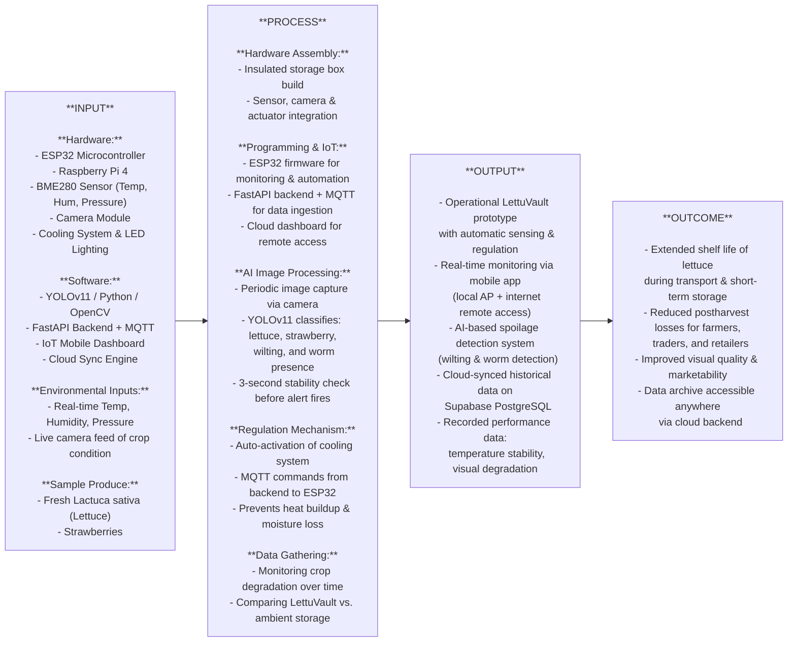
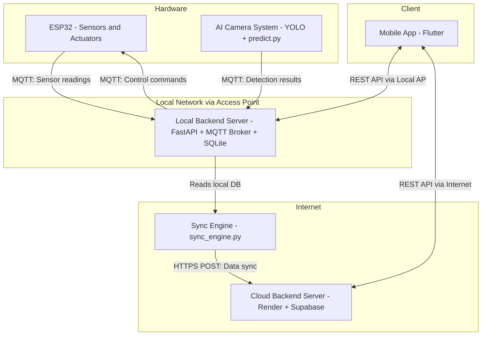
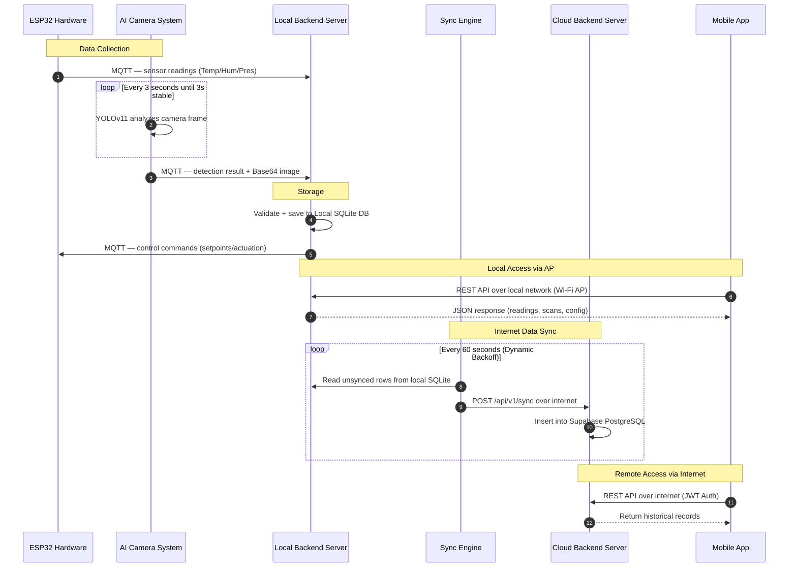

# LettuVault — Project Root
> [!IMPORTANT]
> **Python Version Requirement**: This project requires **Python 3.10.11**.

## 📂 Current Structure

```text
LettuVault/                     <-- Root Folder (The Workspace)
├── .venv/                      <-- Python Virtual Environment
├── pyproject.toml              <-- Root Workspace Config (Maps packages)
├── requirements.txt            <-- Master Dependencies List
├── .env                        <-- Secret config (NEVER commit to Git!)
├── .gitignore                  <-- Git ignore rules
│
├── ai_system/                  <-- AI Worker (Package: lettu_vault_ai)
│   ├── pyproject.toml
│   ├── runs/lettuce_strawberry_v12/weights/best.pt  <-- Trained YOLO Model
│   ├── datasets/               <-- data.yaml and training images
│   └── src/lettu_vault_ai/
│       ├── predict.py          <-- MAIN: Camera + YOLO + MQTT Publisher
│       └── __init__.py
│
├── backend/                    <-- Web Server (Package: lettu_backend)
│   └── src/lettu_backend/
│       ├── main.py             <-- FastAPI entry + run_system() launcher
│       ├── api/
│       │   └── v1/
│       │       └── endpoints.py <-- MAIN: REST API Routes (CRUD logic)
│       ├── core/
│       │   ├── config.py       <-- Reads from .env (MQTT, DB, API Keys)
│       │   └── security.py     <-- API Key & JWT auth
│       ├── models/
│       │   ├── database.py     <-- SQLAlchemy: ai_scans + sensor_readings
│       │   └── domain.py       <-- Pydantic: Request/Response schemas
│       ├── services/
│       │   ├── broker_service.py   # Local MQTT Broker (127.0.0.1:1883)
│       │   ├── mqtt/               # Modular MQTT Subsystem (Subscribers)
│       │   └── log_hub.py          # VS Code TUI (j/k log switcher)
│       ├── repository/
│       │   └── scan_repo.py    <-- DataRepository (ai_scans + sensor_readings CRUD)
│       ├── schemas/
│       │   └── __init__.py     <-- Input validators (Pydantic, equiv. of Zod schemas)
│       └── templates/
│           ├── dashboard.html  <-- Live data dashboard (4 panels)
│           └── simulator.html  <-- Hardware simulator
│
├── embedded/                   <-- ESP32 Source Code (Work in progress)
├── mobile/                     <-- Flutter Source Code (Work in progress)
│
├── cloud-server/               <-- Render Cloud Mirror (Package: cloud_backend)
│   ├── pyproject.toml
│   └── src/cloud_backend/
│       ├── main.py             <-- Cloud FastAPI entry + UI rendering
│       ├── api/v1/endpoints.py <-- Cloud REST API (/sync logic)
│       └── template/           <-- Cloud web templates (/home, /love)
│
├── data/lettu_vault.db         <-- SQLite Database (auto-created)
├── clear_db.py                 <-- Utility: Wipe all records from DB
├── verify_data.py              <-- Utility: Count records in each table
└── sync_engine.py              <-- Background API Worker: Syncs local DB to Cloud
```

---

## 🏗️ System Design Overview (IPO Model)

LettuVault is a smart postharvest storage system for *Lactuca sativa* (lettuce) that combines IoT hardware, Edge AI, and cloud connectivity to extend shelf life and reduce postharvest losses.



---

## ⚙️ Technical System Architecture

Internal communication and data flow between all system nodes.



### Component Breakdown
1. **ESP32 (`/embedded/`):** Reads live BME280 telemetry (Temp, Humidity, Pressure) and publishes to the MQTT broker. Listens for actuation commands from the backend to control the cooling system and LEDs.
2. **AI Camera System (`/ai_system/`):** Runs offline YOLOv11 inference on a local camera feed. Uses a 3-second stability check to confirm detections before publishing results + Base64 image to the MQTT broker.
3. **Local Backend Server (`/backend/`):** The central hub. Subscribes to MQTT to ingest all sensor and AI data into local SQLite. Exposes REST API for the mobile app over the local AP network.
4. **Sync Engine (`sync_engine.py`):** Background worker that reads unsynced rows from local SQLite using watermark timestamps and POSTs them in batches to the cloud server. Uses dynamic backoff to burn down large backlogs fast.
5. **Cloud Backend Server (`/cloud-server/`):** Deployed on Render, backed by Supabase PostgreSQL. Receives synced data, provides remote REST API access for the mobile app, and serves the public web dashboard.
6. **Mobile App (`/mobile/`):** Flutter app that connects to the local backend (via AP) for real-time monitoring, and to the cloud backend (via internet) for remote historical access.

---


## 🔄 Full Lifecycle Data Flow

This outlines exactly how data travels across all systems in LettuVault — from physical sensors to mobile access.



---

## 💻 Local Sandbox Execution Flow

When running locally using `lettu_vault_start`, the system spins up everything automatically in a unified TUI. Here is how the processes orchestrate underneath:

```text
.env (single source of config)
    │
    ▼
[lettu_vault_start]
    │
    ▼
[Log Hub TUI] ─── starts ──► [broker_service.py] → MQTT Broker @ 127.0.0.1:1883
    │                                                       │
    ├── starts (after 4s) ──► [main.py / uvicorn]          │ (message hub)
    │                          FastAPI @ :8000              │
    │                          + mqtt module ◄──────────────┤ (subscribes)
    │                            ├── lettuvault/ai          │
    │                            └── lettuvault/sensors     │
    │                                                       │
    ├── starts ──────────────► [predict.py]   ─────────────┘
    │                          AI Camera              (publishes)
    │                          + YOLO Model
    │
    └── starts ──────────────► [sync_engine.py]
                               Background Sync Worker
                               Reads local DB every 60s
                               POSTs batches ──────────────► Cloud Server (Render)
                                                              └── Supabase PostgreSQL
```

---

## Setup

```powershell
# 1. Create and activate virtual environment (Requires Python 3.10.11)
py -3.10 -m venv .venv
.\.venv\Scripts\Activate.ps1

# 2. Install all dependencies
pip install -r requirements.txt

# 3. Run database migrations (first time only)
db-upgrade
```

---

## 🔧 Environment Setup & Developer Toggles

When moving between active laptop testing and deployment on the physical hardware Raspberry Pi, you MUST update the parameters in `.env` and the mobile app:

### 1. Root `.env` (Backend / System Logic)
| Flag | What it does | Dev/Test Setting | Production/Raspberry Pi |
|---|---|---|---|
| `IS_PRODUCTION` | Toggles actual OS-level commands (e.g. `nmcli` Wi-Fi connects). | `false` | `true` |
| `CLOUD_SERVER_LOCAL` | Tells the TUI to auto-start the local `cloud-server` on port `8001`. | `true` | `false` |

### 2. Mobile App Config (`mobile/LettuVault_Unfinished/lib/src/core/constants.dart`)
| Constant Name | What it does | Dev/Test Setting | Production Release |
|---|---|---|---|
| `kDevMode` | Splits API errors. True shows raw stack traces (e.g. `SocketException 101`). False shows user-friendly text. | `true` | `false` |
| `kCloudBaseUrl` | The endpoint the app hits when toggled to "Online Mode" or during cloud auth. | Phone: `http://192.168.x.x:8001`<br>Emu: `http://10.0.2.2:8001` | `https://lettuvault.onrender.com` |

---

## 🚀 Running the System

```powershell
lettu_vault_start
```

This opens a **TUI** in your VS Code terminal with 4 tabs:
- **BROKER** (Yellow): Local MQTT server on `127.0.0.1:1883`
- **BACKEND** (Green): FastAPI server on `http://localhost:8000`
- **MQTT** (Cyan): Subscriber routing data to the database
- **AI** (Magenta): Camera + YOLO detections with 3s stability check

**Controls**: `j` (next tab) | `k` (prev tab) | `q` (quit all)

---

## 🛡️ Validation & Contracts (Schemas)

The system uses **Pydantic Schemas** (located in `backend/src/lettu_backend/schemas/`) as a strict validation layer for all inbound data. This is equivalent to Zod in the Next.js ecosystem.

| Schema | Validations |
|---|---|
| **Sensor Data** | Temperature (-20 to 80°C), Humidity (0-100%), Pressure (800-1200 hPa). |
| **Produce Type** | Strict Allowlist: `Lettuce`, `Strawberry`, `Empty / Unknown`, `Camera Test`. |
| **System Config** | Sane setpoint guards to prevent hardware damage from extreme temperature/humidity requests. |
| **Security** | Sanitizes strings to prevent XSS (Script Injection) and SQL Injection patterns. |

Inbound requests that fail these rules are automatically rejected by FastAPI with a `422 Unprocessable Entity` error before they reach the database.

---

## Quick Links

| Page | URL |
|---|---|
| API Health | http://127.0.0.1:8000/ |
| Live Dashboard | http://127.0.0.1:8000/dashboard |
| Swagger API Docs | http://127.0.0.1:8000/docs |
| Hardware Simulator | http://127.0.0.1:8000/simulator |

---

## Utility Scripts

```powershell
python verify_data.py    # Check how many records are in the DB
python clear_db.py       # Wipe all records (keeps table structure)
```
